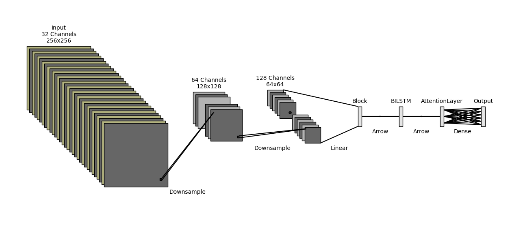

[This project was completed as part of a group effort.]

# Emotion Recognition Model
## Model Architecture

The emotion recognition model is built using a CNN-BiLSTM-Attention architecture. The architecture is designed to capture both spatial and temporal features from the input data, making it well-suited for emotion recognition tasks.



This repository contains the implementation of an emotion recognition model using a CNN-BiLSTM-Attention architecture on KSUEmotion dataset.

## Table of Contents
- [Installation](#installation)
- [Usage](#usage)
- [Contributing](#contributing)
- [License](#license)

## Installation

1. Clone the repository:
    ```bash
    git clone https://github.com/yourusername/AR-Emotion-Recognition.git
    cd AR-Emotion-Recognition
    ```


2. Create and activate a conda environment with Python 3.12.1 and install pip:
    ```bash
    conda create -n emotion_recognition python=3.12.1 pip
    conda activate emotion_recognition
    ```
3. Install the required dependencies:
    ```bash
    pip install -r requirements.txt
    ```
    

## Usage
First exract the KSUEmotion dataset (Download from link sent in submission) in the root folder.
Unzip the 91.65 weights in the root folder as well.

To train and test the emotion recognition model, run the following command:
```bash
python main.py --use_saved_files --include_augmentation
```
To only test the model using pre-trained weights, you need to do at least one training run to save the arrays then run:
```bash
python main.py --test_only
```

To use the original dataset files run without `--use_saved_files`, the data will be saved as arrays and can be re-used using the `--use_saved_files` later.

```bash
python main.py 
```

## Authors
Ali Abouzeid , Bilal Elbouardi & Mohammed Maged


## License

This project is licensed under the MIT License. See the [LICENSE](LICENSE) file for details.
